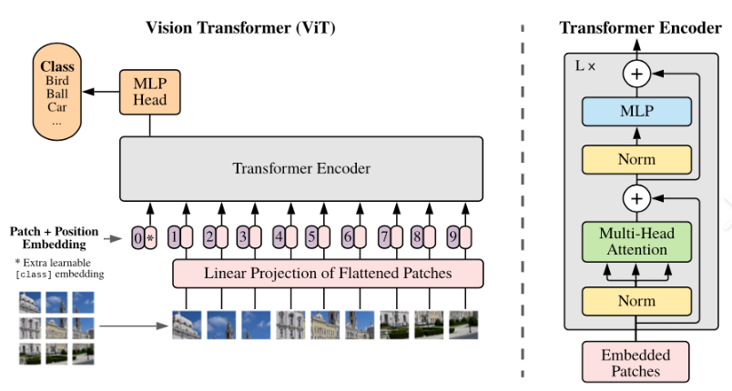
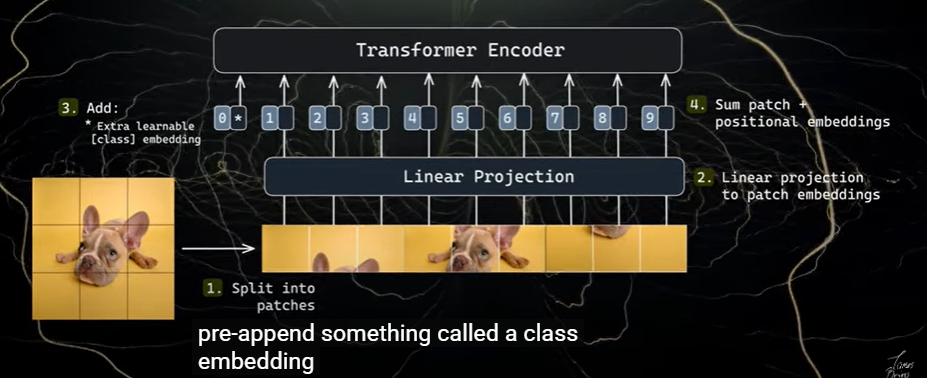

# ViT


## Understanding the Architecture of Vision Transformers

### 1. Image Patching
is the initial step in the Vision Transformer process

For example, a 224x224 pixel image can be segmented into 16x16 pixel patches, resulting in 196 patches. Each patch is then flattened into a vector, enabling the model to work with these smaller, manageable pieces of the image.

```python
from PIL import Image
import numpy as np
from patchify import patchify

patchify(imageToPatch,patchSize,step)
```

- **imageToPatch**: The original image which needs to be patched.
- **patchSize**: The size of each patch image.
- **step**: The step size.

```python
patches=patchify(img_arr,(250,250,3))
print(patches.shape)
```

### 2. Positional Encoding
To maintain the positional information of the patches, positional encodings are added to the patch embeddings.

This crucial step ensures that the model understands where each patch is located in the original image, allowing it to capture spatial relationships effectively.

### 3. Multi-Layer Transformer Encoder
The heart of the Vision Transformer 

**structure**:
- **Self-Attention Layers**: These layers allow the model to evaluate the relationships *between different patches*, helping it to understand how they *interact with one another.*

- **Feed-Forward Layers**: These layers apply non-linear transformations to the output of the self-attention mechanism, enhancing the model's ability to capture complex patterns in the data.

### 4. Classification Head
a critical component of ViTs

utilized to generate predictions for image recognition tasks.

A special token, often referred to as the **classification token** (**CLS**), consolidates information from all patches, producing the final predictions. 

This aggregation of data **ensures that the model leverages insights from the entire image rather than isolated patches**.

## How Vision Transformers Work?
(ViTs) employ a unique architecture to process images by treating them as sequences of patches. This approach enables the model to leverage the power of transformer designs, particularly through the use of self-attention mechanisms.

Vision Transformers begin by dividing an image into **smaller, fixed-size patches**. Each patch is then processed individually as part of a **sequence**, allowing the model to analyze the entire image through its components.

- The **self-attention mechanism** is fundamental to how ViTs operate. This mechanism allows each patch to **influence the representation** of other patches. Specifically, it computes *attention scores that determine how much focus each patch should have on every other patch.*

- This ability to weigh the importance of different patches enables Vision Transformers to understand complex connections and interdependencies throughout the entire image. As a result, ViTs can create more comprehensive and nuanced feature representations, capturing intricate patterns that might be missed by traditional convolutional networks.

---

image -> patches -> input to linear projection -> to patch embeddings->
then add extra learnable [class] embedding-> sum to positional embeddings


---

#### image paches 
is much less comparissions to pixel by pixel
ana bakaren 3elaket el patch bel patches el tanya badal ma akaren pixel b ba2y el pixels

#### linear projection
map image patch arrays to image patch vectors by mapping them with patch embedding to input it to transformer
